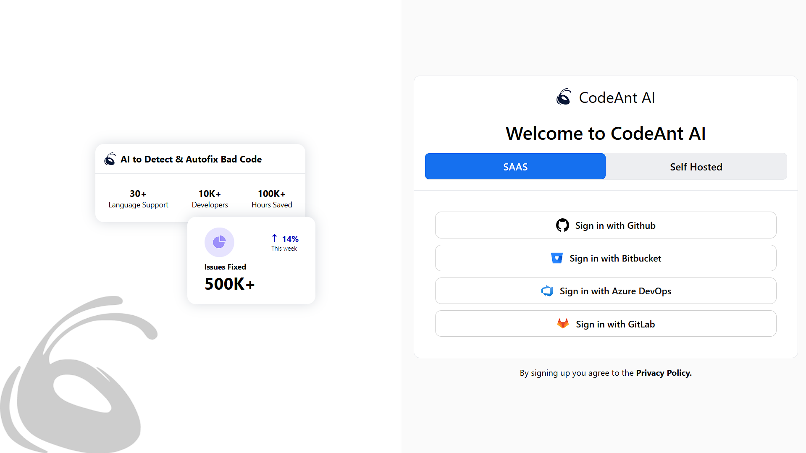
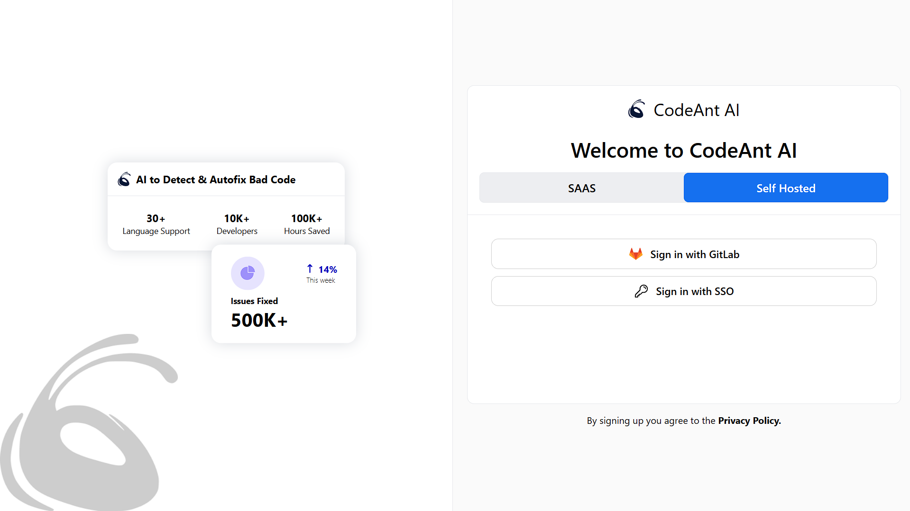
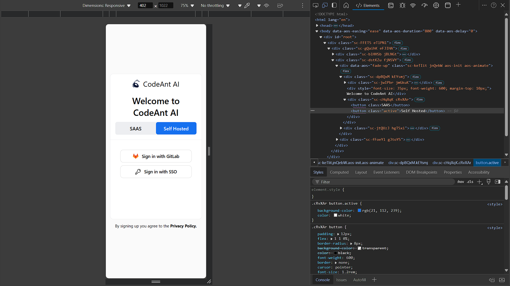
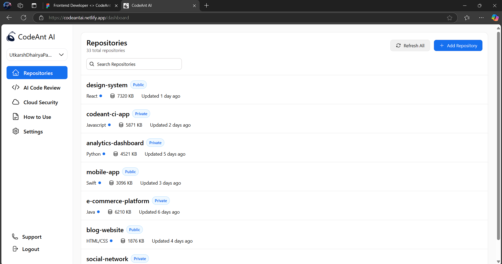
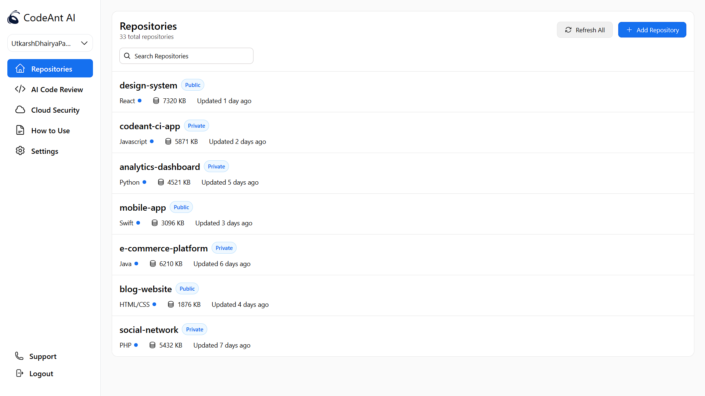
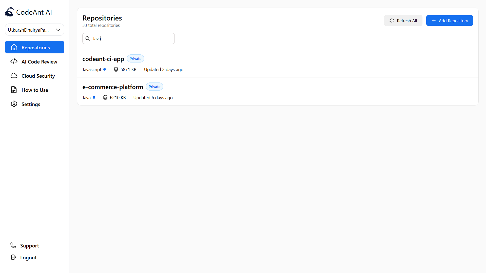
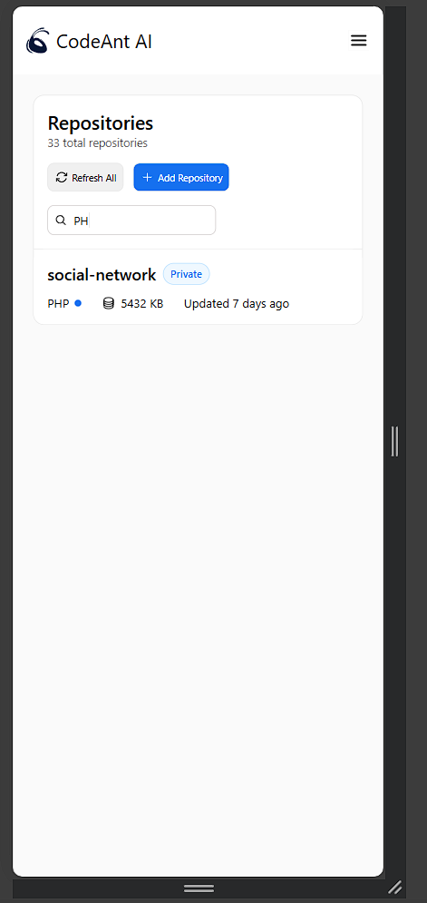
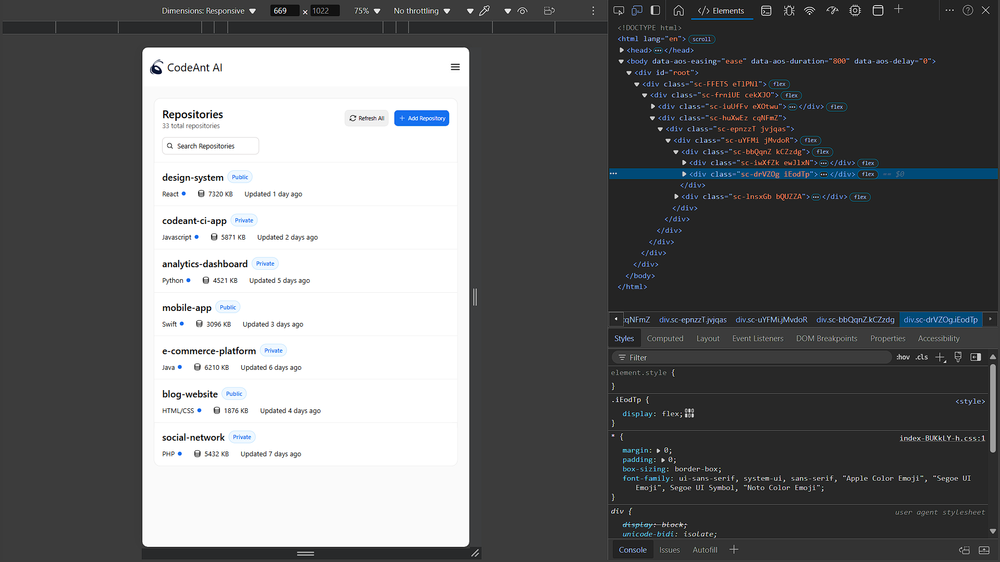
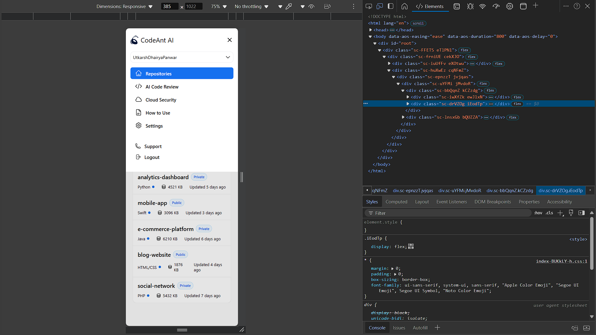
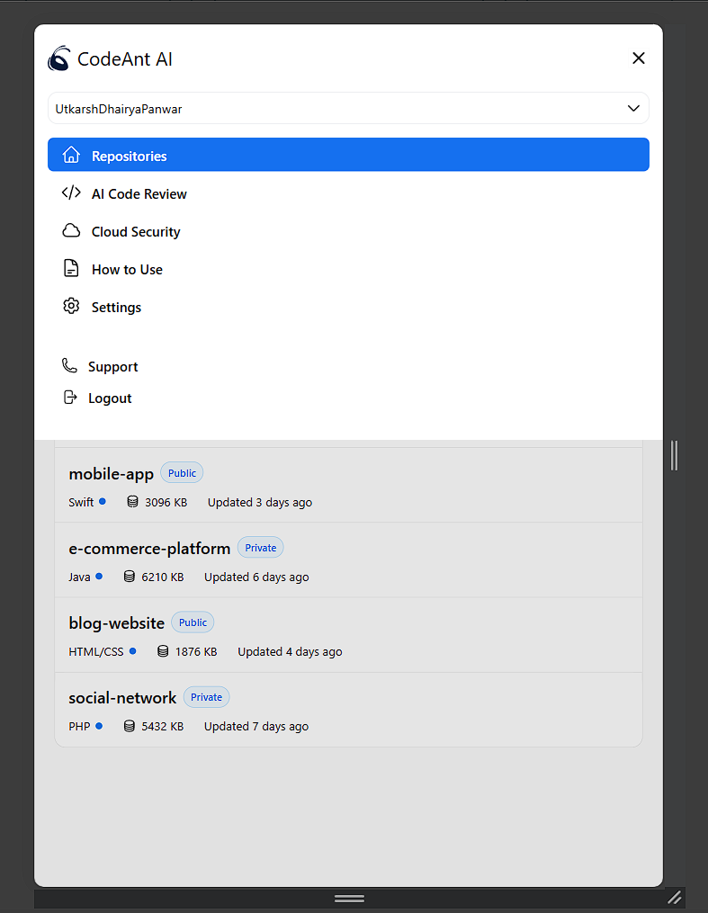

# 📟 CodeAnt AI - Frontend Developer Intern Hiring Assignment

## Table of Contents

- [Introduction](#introduction)
- [Problem Statement](#problem-statement)
- [Solution](#solution)
  - [Live Demo](#live-demo)
  - [Screenshots](#screenshots)
- [Adherence to Guidelines](#adherence-to-guidelines)
- [Deliverables](#deliverables)
- [Documentation](#documentation)
  - [Setup and Installation](#setup-and-installation)
  - [Run Locally](#run-locally)
  - [Build for Production](#build-for-production)
- [Contact](#contact)

---

## 🙏Introduction

✨ Welcome to the **CodeAnt AI Frontend Developer Intern Hiring Assignment** repository! ✨

This project showcases my solution for the assignment provided by **CodeAnt AI**, a Y Combinator-backed startup revolutionizing code quality and security. The objective was to build a responsive, efficient, and visually appealing frontend using **ReactJS**, **HTML**, and **CSS**, adhering to best practices for clean, scalable, and maintainable code.

---

## 📄Problem Statement

The assignment required the following:

- Implement the provided design from the **Figma file** with accuracy.
- Create an intuitive and responsive user interface.
- Ensure a clean and scalable codebase.
- Deliver the completed implementation within the deadline.

**✍️Evaluation Criteria:**

- Code Quality: Clean, readable, and maintainable code.
- Adherence to Design: Accurate implementation of the provided Figma design.
- Functionality: Seamlessly working frontend components.
- Performance: Optimized and responsive UI/UX.
- Responsiveness: Adaptable across various screen sizes and devices.
- Creativity: Efficient solutions to challenges.

---

## 🌐 Live Demo

🚀 The project is live and can be accessed here: [**https://codeantai.netlify.app/**](https://codeantai.netlify.app/)

---

## 📸 Screenshots

Below are some visuals of the implemented design provided to me ->

### LOGIN/SIGIN PAGE -

#### Login Auth using SAAS:  


#### Login Auth using Self Hosted:  


#### Login Auth using SAAS - Mobile Responsive:  


#### Login Auth using Self Hosted - Mobile Responsive:  


### DASHBOARD PAGE -

#### Dashboard: Live Url Page:  


#### Dashboard - Full View:


#### Dashboard - Search Functionality:


#### Dashboard - Search Functionality (Mobile Responsive):


#### Dashboard - Tab Responsive:


#### Dashboard - Slider Menu (Mobile Responsive):


#### Dashboard - Slider Menu (Sleek Mobile Responsive):



### *Visit the 🌐 [Live Site](https://codeantai.netlify.app/) for a full experience!* 
 
---

## 🚫Adherence to Guidelines

✅ **Code Quality:**

- The codebase is clean, maintainable, and scalable.
- Data is not hard-coded; it is stored in a separate JavaScript file, ensuring flexibility and reusability.

✅ **Component Architecture:**

- Components are efficiently structured to maximize reusability and readability.
- Animations are implemented cleanly, enhancing the user experience without overloading the interface.

✅ **Technologies Used:**

- **ReactJS** for efficient component-based architecture.
- **HTML** and **CSS** for structured and styled UI elements.
- Responsive design principles to ensure the UI works seamlessly across devices.

✅ **Responsiveness:**

- The design adapts beautifully to various screen sizes, providing an optimal user experience on all devices.

✅ **Animations:**

- Subtle, professional animations enhance the interface without overwhelming the user.

---

## 📤Deliverables

1. **GitHub Repository**: [CodeAnt AI Frontend Developer Assignment](https://github.com/Hailex798/CodeAnt_AI-Frontend-Developer-Intern-Hiring-Assignment)
2. **Live Demo**: [https://codeantai.netlify.app/](https://codeantai.netlify.app/)
3. **Supporting Documentation**: Instructions for running the project locally are provided below.

---

## 📜Documentation

### Setup and Installation

To get started, clone the repository and install the dependencies.

```bash
# Clone the repository
git clone https://github.com/Hailex798/CodeAnt_AI-Frontend-Developer-Intern-Hiring-Assignment.git

# Navigate to the project directory
cd CodeAnt_AI-Frontend-Developer-Intern-Hiring-Assignment

# Install dependencies
npm install
```

### Run Locally

To start the development server:

```bash
npm run dev
```

This will run the project locally at `http://localhost:5173`.

### Build for Production

To build the project for production:

```bash
npm run build
```

The production-ready files will be in the `build` directory.

### Running the Build Locally

You can serve the build files locally using a simple HTTP server:

```bash
# Install a simple HTTP server
npm install -g serve

# Serve the production build
serve -s build
```

Navigate to `http://localhost:3000` to view the production build.

---

## ✉️Contact

If you have any questions or issues, please feel free to reach out:

- **Email**: [kshitijsinghbisht777@gmail.com](mailto:kshitijsinghbisht777@gmail.com)
- **LinkedIn**: [Kshitij Singh Bisht](https://linkedin.com/in/kshitijsinghbisht/)
- **Portfolio**: [Kshitij](https://kshitijsinghbisht.netlify.app/)

---

🎉 Thank you for reviewing this project! I look forward to your feedback and the opportunity to contribute to CodeAnt AI's innovative mission.

